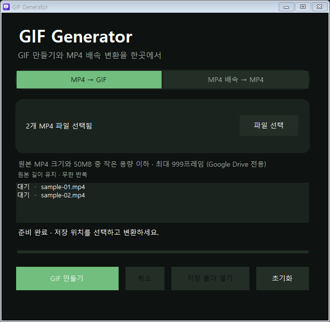
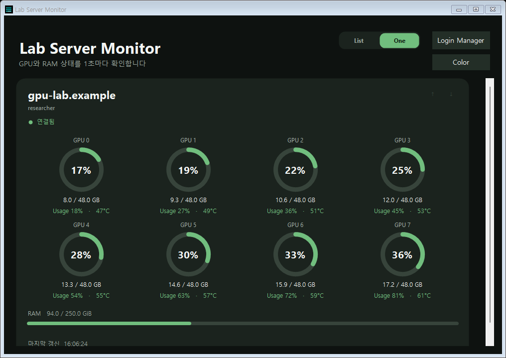
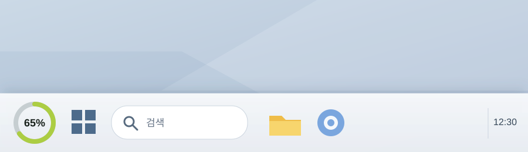
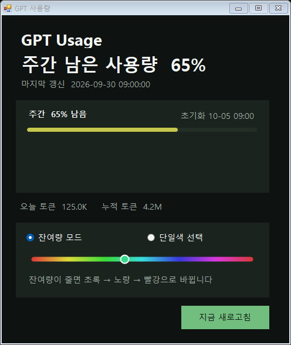

# My Windows Apps

설치 파일 하나로 필요한 Windows 앱만 골라 설치할 수 있습니다.

## 설치: 1 → 2 → 3

1. **다운로드** — [최신 설치 파일 받기](https://github.com/Lee-JaeWon/My-Windows-Apps/releases/latest/download/My.Windows.Apps.Setup.exe)
2. **실행** — 받은 `My.Windows.Apps.Setup.exe`를 더블클릭합니다.
3. **선택** — 원하는 앱을 체크하고 **선택한 앱 설치**를 누릅니다. 바탕화면에 바로가기가 만들어집니다.

같은 설치 파일에서 **선택한 앱 삭제**도 할 수 있습니다.

> 아래 화면의 파일명·서버·GPU·사용량은 설명을 위한 가상 데이터입니다.

## 1. GIF Generator

MP4 여러 개를 GIF로 변환하거나 MP4 재생 속도를 바꿉니다. GIF는 **원본 MP4 크기와 50MB 중 작은 용량 이하**, **999프레임 이하**로 만듭니다.

## 2. Lab Server Monitor

서버 또는 내 컴퓨터의 **GPU 메모리·사용률·온도와 RAM**을 1초마다 보여줍니다. GPU가 많을 때는 **One** 화면에서 한눈에 볼 수 있고, **Login Manager**에서 서버를 추가합니다.

## 3. GPT Usage Tray

Codex Pro의 **주간 남은 사용량**을 작업 표시줄 왼쪽에 표시하고 1분마다 갱신합니다. 위젯을 누르면 상세 화면과 색상 설정이 열립니다.

## Windows 보안 경고가 나오면

- **“Windows의 PC 보호”**: **추가 정보 → 실행**을 누릅니다.
- **“스마트 앱 컨트롤이 안전하지 않을 수 있는 앱을 차단했습니다”**: `Windows 보안 → 앱 및 브라우저 컨트롤 → 스마트 앱 컨트롤 설정 → 끄기`로 변경한 뒤 다시 실행합니다. 이 설정은 PC 전체에 적용됩니다. [Microsoft 안내](https://support.microsoft.com/en-us/windows/security/threat-malware-protection/smart-app-control-frequently-asked-questions)

보안 경고 안내는 **이 저장소에서 직접 받은 설치 파일**에만 적용하세요.
